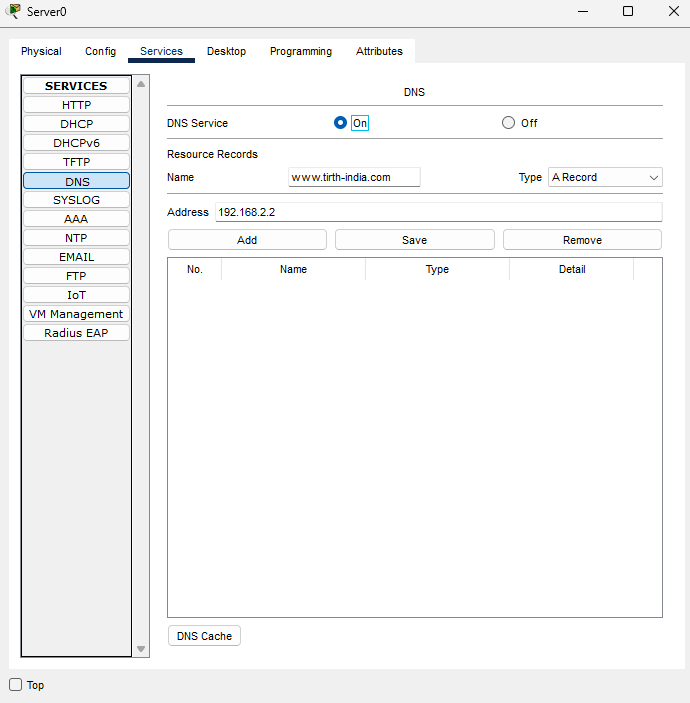
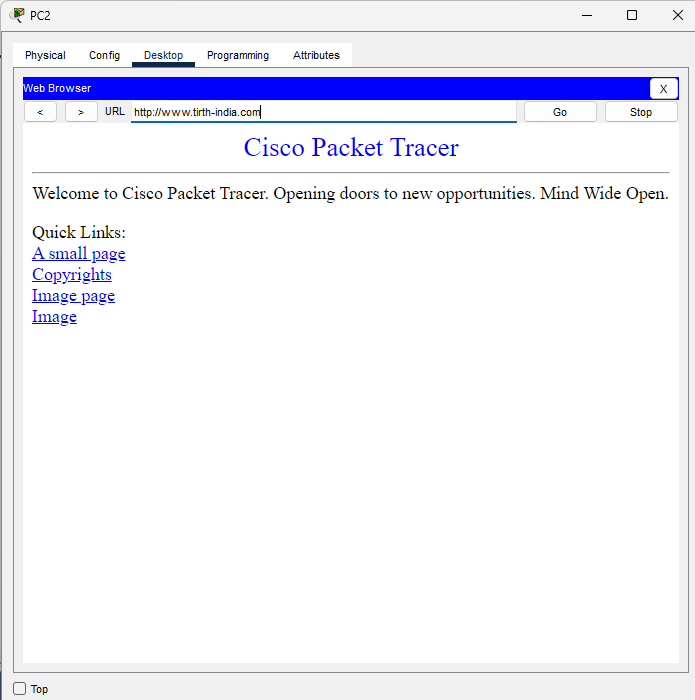

# 🌐 DNS Server Configuration in Cisco Packet Tracer

## 📘 Project Overview

This project demonstrates how to configure a **DNS (Domain Name System)** server using **Cisco Packet Tracer**. DNS resolves domain names (like `www.tirth-india.com`) into IP addresses so that end devices can access servers or websites within a simulated network environment.

---

## 🎯 Objectives

- Configure a DNS server to resolve domain names to IP addresses.
- Validate DNS resolution by accessing a domain name from a client browser.
- Learn how DNS helps in identifying devices using domain names in a network.

---

## 🛠️ Tools & Services Used

- Cisco Packet Tracer 
- DNS Service     
- Web Browser        

---

## 🧪 Implementation Steps

### 🔧 1. DNS Server Configuration

1. Drag a **Server** device into the workspace.
2. Click on the server ➝ Go to **Services** tab ➝ Choose **DNS**.
3. Turn **DNS Service** ON.
4. Add a new DNS entry:
   - **Name**: `www.tirth-india.com`
   - **Address**: IP address of a web server (e.g., `192.168.2.2`)
5. Save the entry.

🖼️ *DNS Configuration*

---

### 🌐 2. Test DNS Using Web Browser

1. Use a **PC** in the network.
2. Go to **Desktop** tab ➝ Click **Web Browser**.
3. Enter the URL `http://www.tirth-india.com`.
4. If DNS is correctly configured, it will resolve and load the website hosted at the mapped IP.

🖼️ *DNS Open in Browser*

---

## ✅ Output

- DNS server correctly resolved the domain `www.tirth-india.com`.
- Client PC was able to open the website using a domain name.
- Verified that the DNS server is functioning in the simulated environment.
