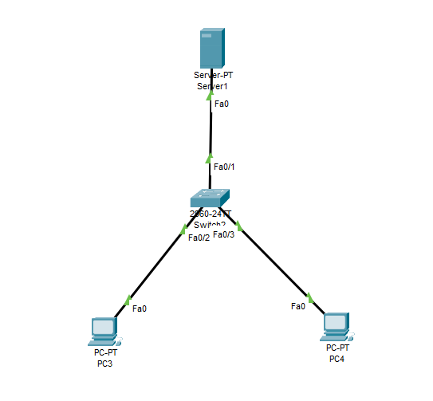
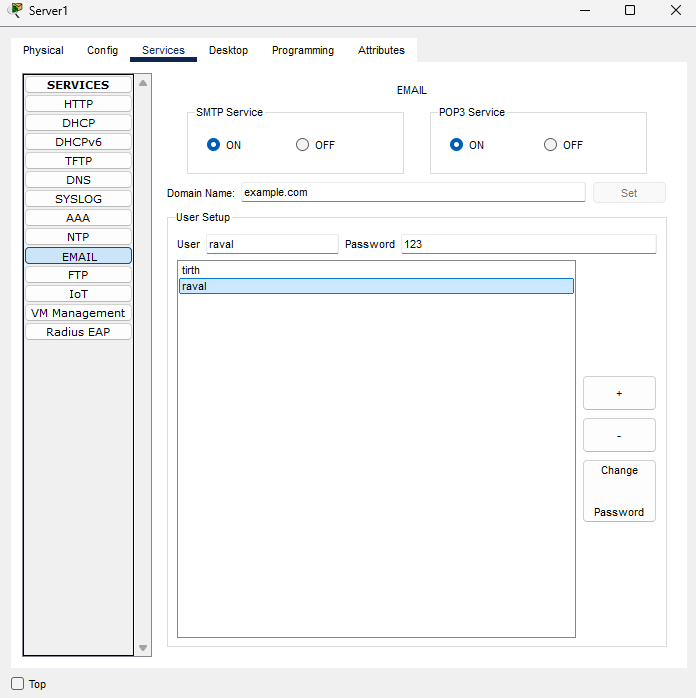
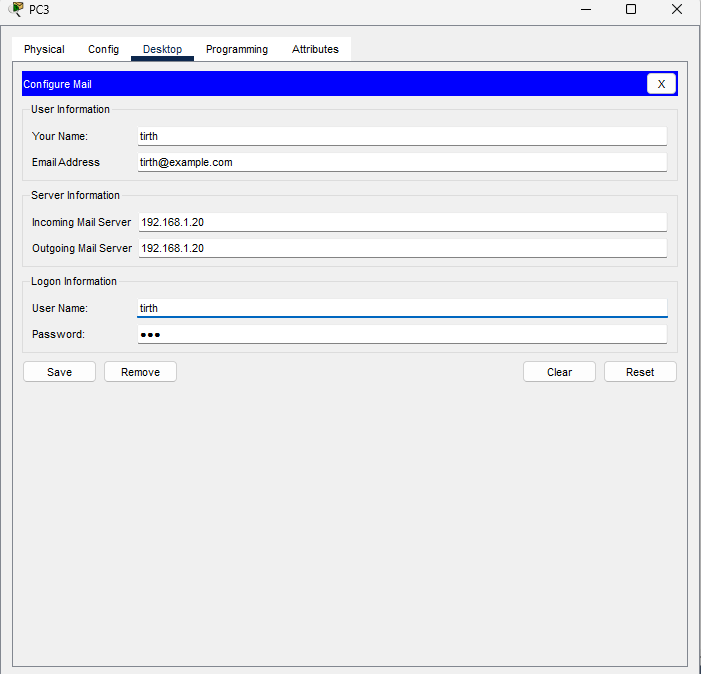
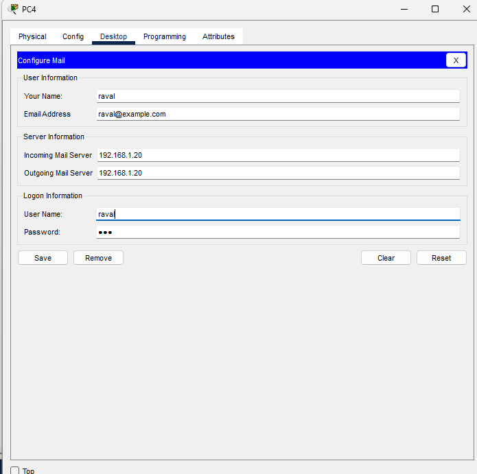
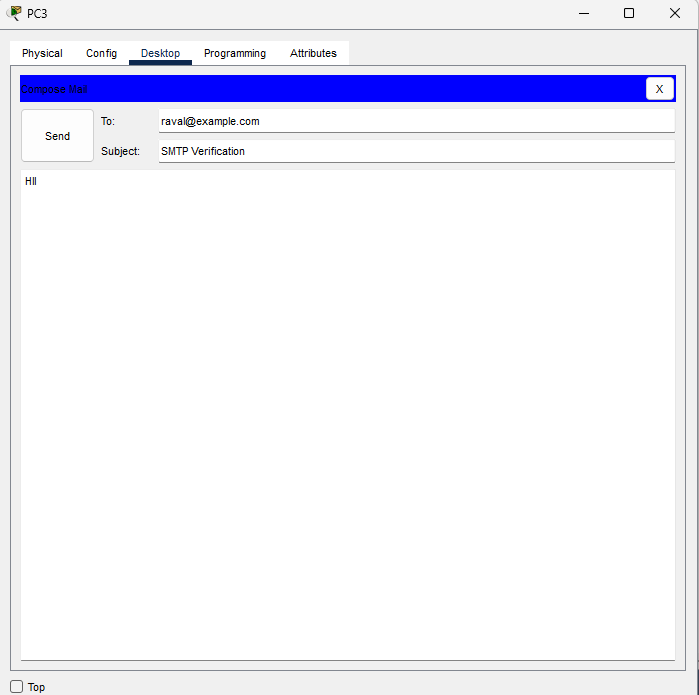
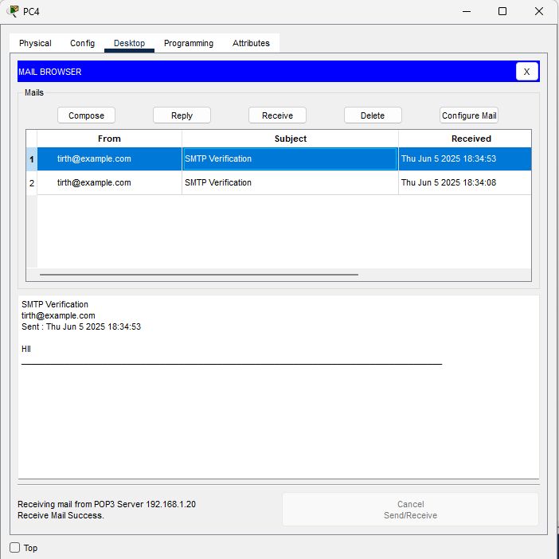

# 📧 Email Server Configuration using Cisco Packet Tracer

This project demonstrates how to set up an Email Server in Cisco Packet Tracer to enable communication between users through mail services (SMTP & POP3).

---

## 📘 Project Overview

We configure an Email Server along with two end devices (PC3 and PC4) to send and receive emails. This helps understand how basic email infrastructure works in a simulated network.

---

## 🎯 Objectives

- Configure a mail server with SMTP and POP3.
- Set up mail accounts on client PCs.
- Send and receive email between PCs.
- Verify successful delivery and receipt of mail.

---

## 🛠️ Tools Used

- Cisco Packet Tracer
- 1 Switch
- 1 Server (Email)
- 2 PCs (PC3 & PC4)

---

## 🌐 Network Topology

---

## ⚙️ Configuration Steps

### 🖥️ Step 1: Configure Email Server

- Go to `Services` tab of Server
- Enable:
  - **SMTP**
  - **POP3**
- Set Domain Name (e.g., `example.com`)
- Create user accounts:
  - `tirth` with password `123`
  - `raval` with password `123`

---

### 💻 Step 2: Configure PC3 (Sender)

- Go to PC3 → Desktop → Email
- Set Your Name: `tirth`
- Set Email Address: `tirth@example.com`
- Incoming Mail Server: `192.168.1.20`
- Outgoing Mail Server: `192.168.1.20`
- Username: `tirth`, Password: `123`

---

### 💻 Step 3: Configure PC4 (Receiver)

- Go to PC4 → Desktop → Email
- Set Your Name: `raval`
- Email Address: `raval@example.com`
- Incoming Mail Server: `192.168.1.20`
- Outgoing Mail Server: `192.168.1.20`
- Username: `raval`, Password: `123`

---

### 📤 Step 4: Send Email from PC3 to PC4

- PC3 → Email → Compose → To: `raval@example.com`
- Subject: `SMTP Verification`
- Message: `Hii`
- Click **Send**

---

### 📥 Step 5: Receive Email on PC4

- PC4 → Email → Receive
- Email should be visible in inbox

---

## ✅ Output Verification

- Email successfully sent from `PC3` to `PC4`
- PC4 received and displayed the mail correctly

---

## 🗂️ Folder Structure

EMAIL/

    ├── 01-Topology.png
    ├── 02-Email-Server-Configuration.png
    ├── 03-Configure-Mail-PC3.png
    ├── 04-Configure-Mail-PC4.png
    ├── 05-Send-Mail-PC3.png
    ├── 06-Receive-Mail-PC4
    └── README.md
