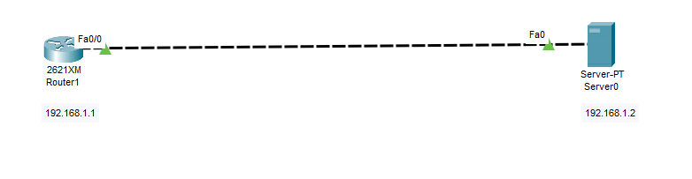
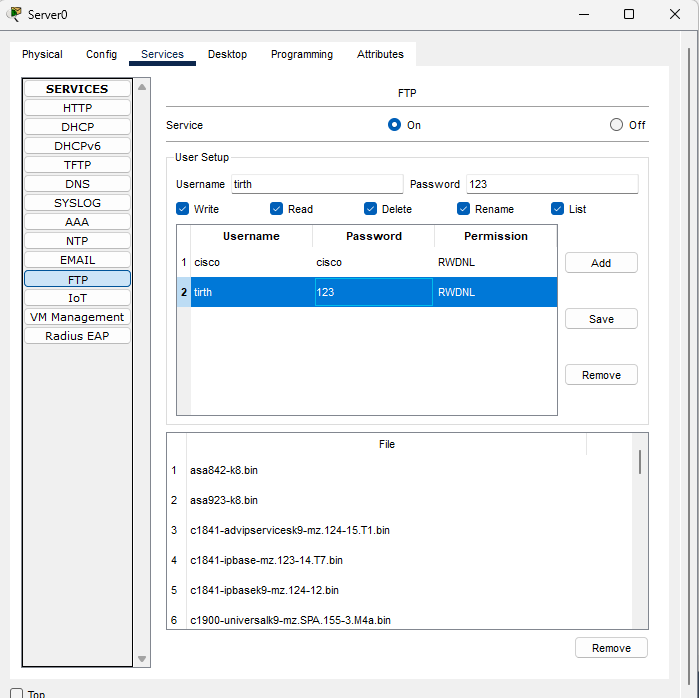
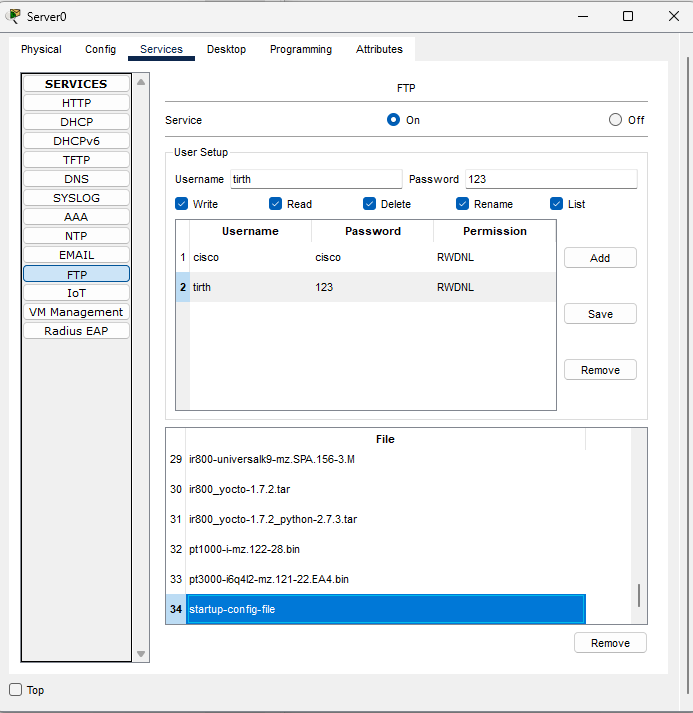

# 📁 FTP Server Configuration using Cisco Packet Tracer

This project demonstrates how to configure an FTP server and perform file transfer operations between a router and the server using Cisco Packet Tracer.

---

## 📘 Project Overview

The objective is to set up an FTP server to store router configuration files. The router will send the `startup-config` to the FTP server using the CLI.

---

## 🎯 Objectives

- Configure a basic FTP server.
- Set FTP username and password on the router.
- Upload the startup-config file from the router to the FTP server.
- Verify successful file transfer.

---

## 🛠️ Tools Used

- Cisco Packet Tracer
- 1 Router
- 1 Server (FTP)

---

## 🌐 Topology

---

## ⚙️ Configuration Steps

### 🖥️ Step 1: Configure FTP Server

- Assign IP address: `192.168.1.2`
- Enable FTP service
- Add username: `tirth`
- Add password: `123`

---

### 📤 Step 2: Configure and Upload from Router

Run the following commands on the router:

<pre>Router# copy running-config startup-config
Destination filename [startup-config]? 
Building configuration...
[OK]</pre>

<pre>Router(config)# ip ftp username tirth
Router(config)# ip ftp password 123</pre>

<pre>Router# copy startup-config ftp:
Address or name of remote host []? 192.168.1.2
Destination filename [Router-confg]? startup-config-file</pre>

---

### ✅ Output Verification

- File startup-config-file should now be available on the FTP server.

---

### 🗂️ Folder Structure

FTP-Server-Project/

    ├── 01-Topology.png
    ├── 02-FTP-Configuration.png
    ├── 03-File-Copy-To-FTP-Server.png
    └── README.md
