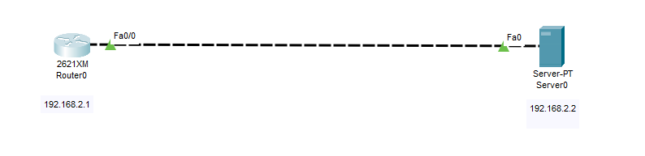

# ⏰ NTP (Network Time Protocol) Server Configuration using Cisco Packet Tracer

This project demonstrates how to configure an NTP server and synchronize time on a router using Cisco Packet Tracer.

---

## 🎯 Objectives

- Understand and configure NTP on a router.
- Synchronize time with a configured NTP server.
- Verify clock synchronization status using CLI.

---

## 🛠️ Tools Used

- Cisco Packet Tracer
- 1 Router
- 1 Server (configured as NTP server)

---

## 🌐 Network Topology

---

## ⚙️ Configuration Steps

### 🔧 Step 1: Configure NTP Server

On the NTP server (PC or Server device):
- Set the IP address: `192.168.2.2`
- Enable NTP service in the server configuration panel 

### 📡 Step 2: Configure NTP Client (Router)

Run the following command on the router:

<pre>Router(config)# ntp server 192.168.2.2</pre>

- This sets the router to synchronize its time with the NTP server at IP 192.168.2.2.

---

### ✅ Verification Commands

🕒 Check NTP Synchronization Status

<pre>Router# show ntp status</pre>

Expected Output:

<pre>Clock is synchronized, stratum 16, reference is 192.168.2.2
...
last update was 2 sec ago.</pre>

- This confirms that the router clock is successfully synchronized with the NTP server.

---

### 🔗 Check NTP Associations

<pre>Router# show ntp associations</pre>

Expected Output:

<pre>*~192.168.2.2   127.127.1.1     1    ...   delay ...  offset ...
 * sys.peer</pre>

`*` indicates the currently selected NTP server (sys.peer).

`~` means it’s a configured peer.

---

### ⏱️ Check the Clock

<pre>Router# show clock</pre>

Sample Output:

<pre>17:17:15.255 UTC Thu Jun 5 2025</pre>

- The router's clock reflects the synchronized time received from the NTP server.
