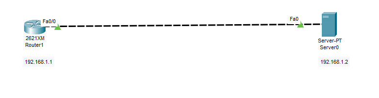

# 🧾 Syslog Server Configuration using Cisco Packet Tracer

This project demonstrates how to configure a Syslog server to collect and monitor log messages from a Cisco router in a simulated network using Packet Tracer.

---

## 📘 Project Overview

Syslog (System Logging Protocol) allows network devices like routers to send log messages to a central server for storage, monitoring, and analysis. This is crucial for troubleshooting and auditing network events.

In this setup:
- A router is configured to send log messages to a Syslog server.
- The server captures logs including ICMP packet events triggered using the `debug ip icmp` command.

---

## 🎯 Objectives

- Configure a Syslog server to collect log messages from a router.
- Enable debugging on the router to generate real-time logs.
- Verify the logs on the Syslog server.

---

## 🛠️ Tools Used

- Cisco Packet Tracer
- 1 Router
- 1 Server (Syslog enabled)

---

## 🌐 Network Topology

📷 

---

## ⚙️ Configuration Steps

### 🖥️ On the Router

<pre>Router(config)# logging 192.168.1.2              # Set Syslog server IP
Router(config)# logging trap debugging           # Send debugging-level messages
Router(config)# logging on                       # Enable logging
Router(config)# service timestamps log datetime msec   # Enable timestamp in logs</pre>

---

### 🐛 Generate Debug Logs

<pre>Router# debug ip icmp                            # Enable ICMP debug logs
Router# ping 192.168.1.2                         # Send ping to generate logs</pre>

---

### 📋 Sample Log Output on Router

<pre>*Mar 01, 00:12:56.1212: ICMP: echo reply rcvd, src 192.168.1.2, dst 192.168.1.1</pre>

---

### 🧾 Syslog Server Output

📷 

- The Syslog server receives and displays real-time log messages, confirming that logging is working correctly.
