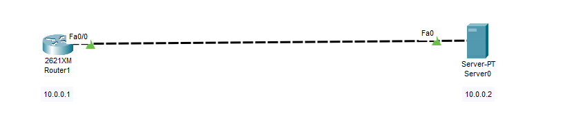
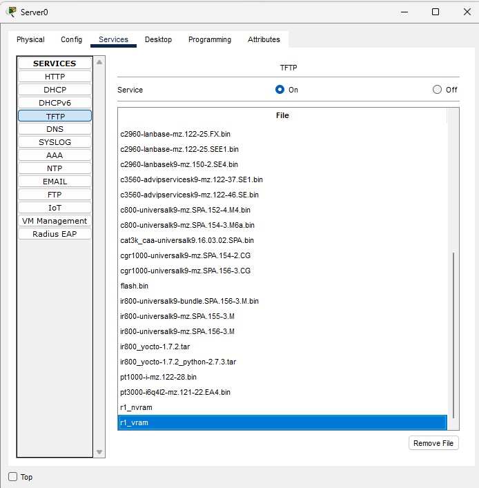
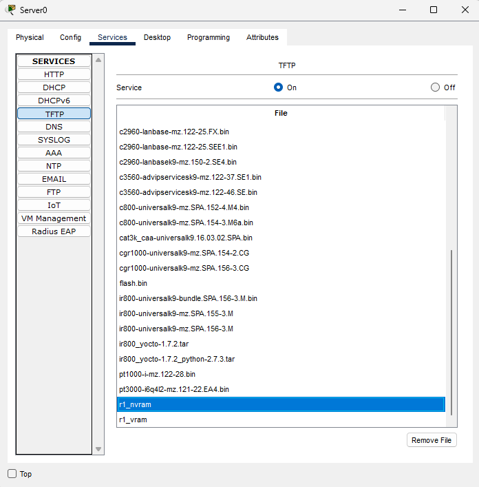

# 💾 TFTP Server Configuration & ROMmon Recovery using Cisco Packet Tracer

This project demonstrates how to configure a TFTP server to backup and restore Cisco router configurations and IOS image files. It also covers a real-world scenario for **disaster recovery** using **ROMmon mode** to reinstall a deleted IOS.

---

## 📘 Project Overview

A TFTP (Trivial File Transfer Protocol) server is used in networking to transfer configuration files and IOS images between routers and servers. This project walks through:
- Backing up running and startup configurations to a TFTP server
- Backing up the IOS image to a TFTP server
- Deleting the IOS to simulate failure
- Recovering the router using ROMmon mode via TFTP

---

## 🛠️ Tools Used

- Cisco Packet Tracer
- One Router
- One Server (TFTP service enabled)

---

## 🌐 Network Topology

📷 **Image: 01-Topology**

---

## 🧪 Step-by-Step Configuration

### 1️⃣ Backup Configuration Files

<pre>Router#copy running-config tftp:
Address or name of remote host []? 10.0.0.2
Destination filename [Router-confg]? r1_vram</pre>

<pre>Router#copy startup-config tftp:
Address or name of remote host []? 10.0.0.2
Destination filename [Router-confg]? r1_nvram</pre>

---

### 2️⃣ Backup IOS Image

<pre>Router#copy flash: tftp:
Source filename []? c2600-i-mz.122-28.bin
Address or name of remote host []? 10.0.0.2
Destination filename [c2600-i-mz.122-28.bin]? flash.bin</pre>

---

### 3️⃣ Simulate Failure: Delete IOS

<pre>Router#delete flash:c2600-i-mz.122-28.bin</pre>

- The router will now reboot into ROMmon mode.

---

4️⃣ ROMmon Configuration for IOS Recovery

<pre>rommon 2 > IP_ADDRESS=10.0.0.1
rommon 3 > IP_SUBNET_MASK=255.0.0.0
rommon 4 > DEFAULT_GATEWAY=10.0.0.2
rommon 5 > TFTP_SERVER=10.0.0.2
rommon 6 > TFTP_FILE=flash.bin
rommon 7 > tftpdnld</pre>

After file reception completes:

<pre>rommon 8 > reset</pre>

---

5️⃣ Restore Configurations

<pre>Router#copy tftp: running-config
Source filename []? r1_vram</pre>

<pre>Router#copy tftp: startup-config
Source filename []? r1_nvram</pre>

---

✅ Final Flash Verification

<pre>Router#show flash:

- You should now see flash.bin loaded successfully.

---

### 🗂️ Folder Structure

TFTP-Server-Project/

    ├── 01-Topology.png
    ├── 02-r1_vram.png
    ├── 03-r1_nvram.png
    ├── 04-flash-file
    └── README.md
